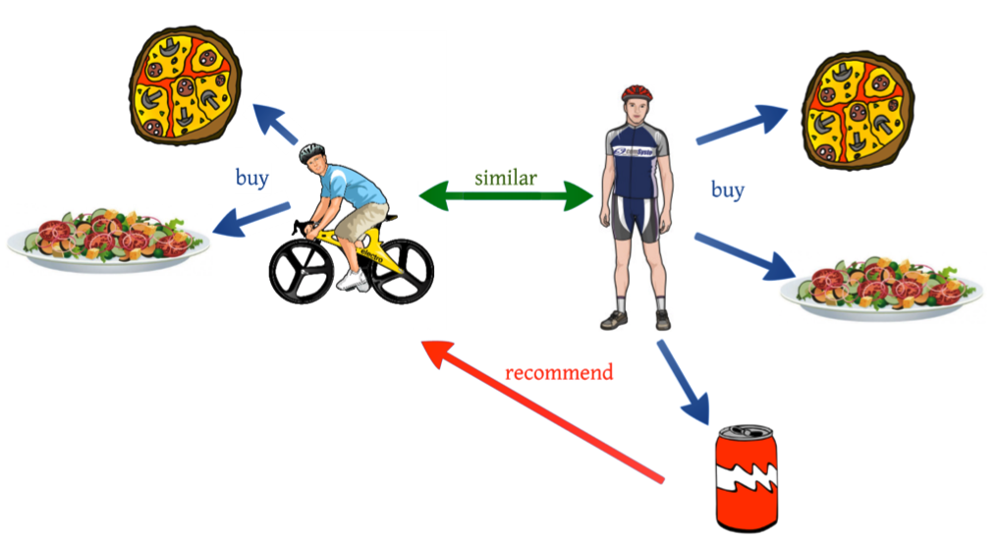
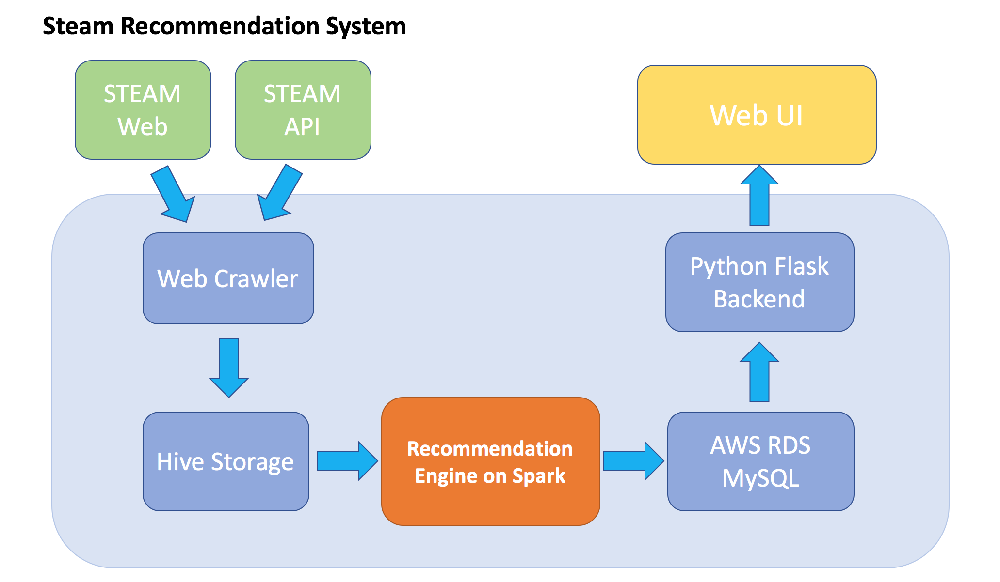
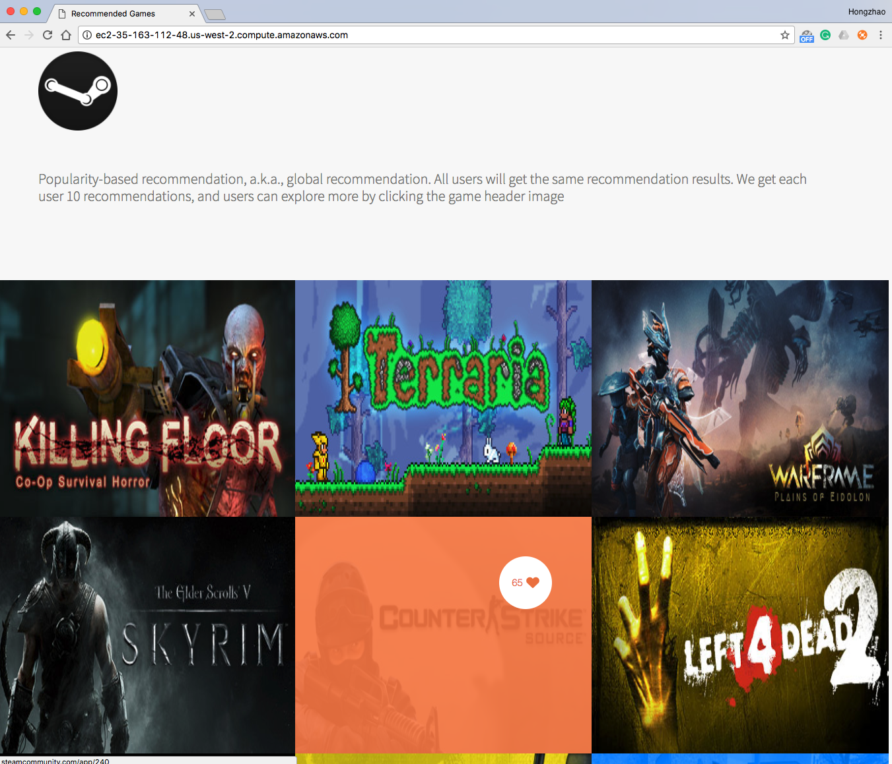
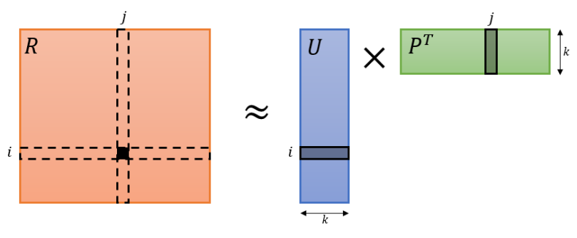
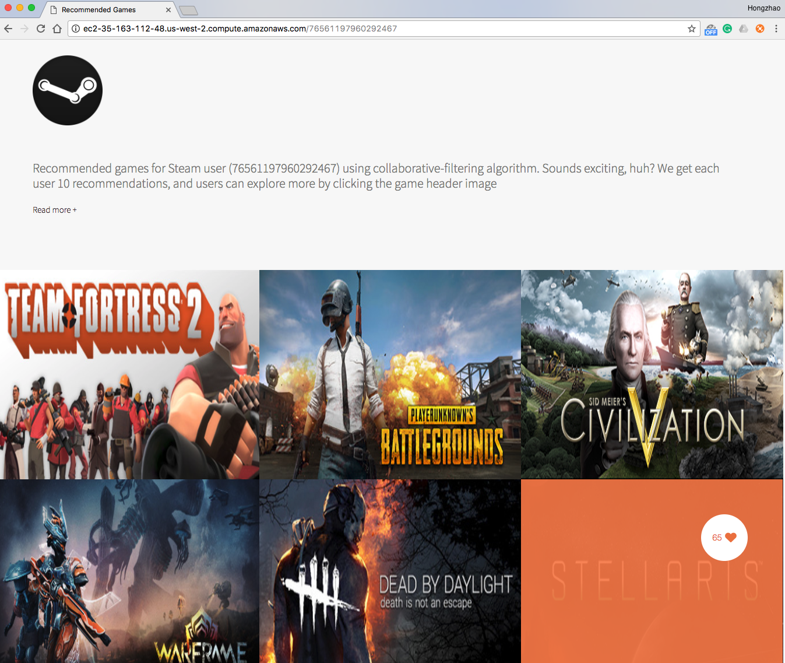

# Project Steam Game Recommendation System

## 1 Overview
<p align="center">

</p>

### 1.1 Introduction
Recommender systems have become increasingly popular in recent years, and are utilized in a variety of areas including movies, music, news, books, research articles, search queries, social tags, and products in general.

A recommender system or a recommendation system is a subclass of information filtering system that seeks to predict the "rating" or "preference" that a user would give to an item.

In this project I implemented a game recommendation system by using the **Collaboritive Filtering algorithm on Spark via Spark's ALS(Alternating Least Squares) API(pyspark.mllib.recommendation.ALS)**. Collaborative filtering methods are based on collecting and analyzing a large amount of information on users’ behaviors, activities or preferences and predicting what users will like based on their similarity to other users.

<p align="center">

</p>

### 1.2 Architecture

The whole project is divided into 3 phases:

1. Collecting Data via Web Crawler
2. Game Recommendation Engine on Spark
3. Web UI Implementation

The architecture of this project is shown below:

<p align="center">

</p>

To implement the Game Recommendation Engine, the first thing we need to do is collecting active/online user's data. So developed a multithreading web crawler to collect user'data from Steam official website and Steam web API. In total, I collected **2385 online users' steamID through 100 pages** , and I also obtained **49140 games' information**. Then I use user's ID to access the Steam API to collect user's friend list, owned games, recently played games and game's played hours (I treated this parameter as the rating). The file size of those data is about **100 ~ 500 MB for each type of data**. All the data were JSON format and then stored in **Hive**.

With the training data, I use **PySpark** as the platform to implement the recommendation engine. The main job of recommendation engine is **processing data via Spark SQL and Hive SQL**(like cleaning data and joining tables) and **realizing the Collaboritive Filtering algorithm via Spark's ALS API**. After that, I created a **MySQL DataBase on AWS RDS** for the later Web UI development, and then store the recommendation results into the MySQL DataBase through **JDBC API**.

Finally, I developed a simple Web UI based on **Python Flask framework** to display the visual recommendation results. The Web UI was deployed on a new **AWS EC2 instance(Ubuntu, 16.04)**. The index page will exhibit **the top 10 popular games based on the total played hours**. When you type the Steam ID for a certain user in the URL as a routing parameter, you will see **the recommendation result for that particular user based on Collaboritive Filtering algorithm**. All the recommendation results will be read from the MySQl on AWS RDS through flask_sqlalchemy module. The following pictures shown below are snapshots of the simple Web UI.

<p align="center">

</p>

<p align="center">

</p>

## 2 Collecting Data via Web Crawler

### 2.1 Collect User's Steam ID

To access user's detailed data via Steam's API, we have to get the user's Steam ID first. Therefore, we have to use **BeautifulSoup and Regular Expression** to parse and search the Steam Members page([https://steamcommunity.com/games/steam/members?p=page_num](https://steamcommunity.com/games/steam/members)) for active players(online or in game). And then naviagte to users' profile pages to fetch their SteamID.

<p align="center">

</p>

Core Function:
```python
def get_online_users(member_list_no, user_ids):
    url = 'https://steamcommunity.com/games/steam/members?p=' + str(member_list_no)
    resp = requests.get(url)

    soup = bs(resp.text, 'html.parser')
    # print(soup.prettify())

    # search profile of users who are online/in-game
    all_users = soup.find_all("div", \
                onclick = re.compile("top\.location\.href='https:\/\/steamcommunity\.com\/id\/(\w+)'"), \
                class_ = re.compile("online|in-game"))

    # get user names
    for user in all_users:
        user_profile = user.div.div.div.a['href'].encode("ascii")
        # print user_profile
        get_user_id(user_profile, user_ids)
```

Save users' Steam ID with index:

```json
{"user_idx": 0, "user_id": "76561197960434622"}
{"user_idx": 1, "user_id": "76561197968459473"}
{"user_idx": 2, "user_id": "76561198010062752"}
{"user_idx": 3, "user_id": "76561198028573551"}
{"user_idx": 4, "user_id": "76561197970323416"}
{"user_idx": 5, "user_id": "76561197968570218"}
```
### 2.2 Get Game Detailed Information

As we have obtained user's Steam ID, Another one important data is Game List. We can get the appid list through API([https://steamcommunity.com/linkfilter/https://api.steampowered.com/ISteamApps/GetAppList/v2/](https://steamcommunity.com/linkfilter/https://api.steampowered.com/ISteamApps/GetAppList/v2/))


Then we can fetch the detailed app information through API([https://store.steampowered.com/api/appdetails?appids=appID](https://store.steampowered.com/api/appdetails?appids=10))

Core Function:
```python
def get_game_detail(app_id_list, num, game_detail_out_file):
    url = 'https://store.steampowered.com/api/appdetails?appids='
    header = {
        'User-Agent': 'Mozilla/5.0 (Macintosh; Intel Mac OS X 10_11_6) AppleWebKit/537.36 (KHTML, like Gecko) Chrome/57.0.2987.133 Safari/537.36',
        'Accept':'text/html,application/xhtml+xml,application/xml;q=0.9,image/webp,*/*;q=0.8',
        'Accept-Encoding':'gzip, deflate, sdch',
        'Accept-Language':'en-US,en;q=0.8,zh-CN;q=0.6,zh;q=0.4,zh-TW;q=0.2'}
    with open(game_detail_out_file, 'w') as f:
        for idx in xrange(num):
            url_temp = url + str(app_id_list[idx])
            time.sleep(.100) # sleep 100ms
            resp = requests.get(url_temp, header)

            obj = resp.json()
            for key in obj:
                if obj[key]["success"] is True :
                    json.dump(obj[key]["data"], f)
                    f.write('\n')
```

Sample Data:
```json
{
   "steam_appid":10,
   "achievements":{
      "total":0
   },
   "price_overview":{
      "currency":"USD",
      "initial":999,
      "final":999,
      "discount_percent":0
   },
   "platforms":{
      "windows":true,
      "mac":true,
      "linux":true
   },
   ...
   "header_image":"https://steamcdn-a.akamaihd.net/steam/apps/10/header.jpg?t=1447887426"
}
```

### 2.3 Get Detailed Player's Information

#### User Info Summaries

Using GetPlayerSummaries (v0002) [API](https://developer.valvesoftware.com/wiki/Steam_Web_API#GetUserStatsForGame_.28v0002.29)

Note:
1. the Steam ID is appended to each record since the original record does not hold such information
2. we need to do some data cleaning during json object extraction since some fields or json hierarchies are not quite useful


#### User Owned Games

Using GetOwnedGames (v0001) [API](https://developer.valvesoftware.com/wiki/Steam_Web_API#GetOwnedGames_.28v0001.29)

#### User Friend List

Using GetFriendList (v0001) [API](https://developer.valvesoftware.com/wiki/Steam_Web_API#GetFriendList_.28v0001.29)

#### User Recently Played Games

Using GetRecentlyPlayedGames (v0001) [API](https://developer.valvesoftware.com/wiki/Steam_Web_API#GetRecentlyPlayedGames_.28v0001.29)

Core Functions:

```python
def process_json_obj(resp, user_out_file, user_id):
    if 'user_summary' in user_out_file:
        # corner case: list index out of range
        try:
            obj = resp.json()['response']['players'][0]
        except:
            obj = {'steamid' : user_id}
    elif 'user_owned_games' in user_out_file:
        obj = resp.json()['response']
        obj = {'steamid' : user_id, 'game_count' : obj['game_count'], 'games' : obj['games']}
    elif 'user_friend_list' in user_out_file:
        obj = resp.json()['friendslist']
        obj = {'steamid' : user_id, 'friends' : obj['friends']}
    elif 'user_recently_played_games' in user_out_file:
        obj = resp.json()['response']
        try:
            obj = {'steamid' : user_id, 'total_count' : obj['total_count'], 'games' : obj['games']}
        except:
            # corner case: total_count is zero
            obj = {'steamid' : user_id, 'total_count' : obj['total_count'], 'games' : []}
    return obj

def dump_user_info(url, user_ids, user_out_file):
    with open(user_out_file, 'w') as f:
        for user_id in user_ids:
            url_temp = url + str(user_id)
            resp = requests.get(url_temp)
            # resp = requests.head(url_temp)
            obj = process_json_obj(resp, user_out_file, user_id)
            json.dump(obj, f)
            f.write('\n')
```

### 2.4 Get Member ID - Multithreading

Modify the member ID retrievial process to accomodate multi-threading. Reuse get_user_id and get_online_users functions. Note, if the number of pages to iterate is small, then multithreading may yield to lower efficiency compared to single threading.

```python
# Multithreaded version of Get_member_ID process
pages_to_iterate = 400
concurrency = 10
# each thread gets its own "user_ids_mt" list
user_ids_mt = defaultdict(list)

def get_online_users_wrapper(lower_bound, upper_bound, user_ids_local):
    for idx in range(pages_lower_bound, pages_upper_bound):
        get_online_users(idx, user_ids_local)

threadlist = []
for thread_id in range(concurrency):
    user_ids_local = user_ids_mt[thread_id]
    pages_lower_bound = pages_to_iterate / concurrency * thread_id + 1
    pages_upper_bound = pages_to_iterate / concurrency + pages_lower_bound
    # print pages_lower_bound
    # print pages_upper_bound
    thread = Thread(target = get_online_users_wrapper, args = (pages_lower_bound, pages_upper_bound, user_ids_local,))
    thread.start()
    threadlist.append(thread)

for thread in threadlist:
    thread.join()
```

### 2.5 Hive Storage

```sql
-- load required SerDe for JSON parsing
ADD JAR json-serde-1.3.9-SNAPSHOT-jar-with-dependencies.jar;
ROW FORMAT SERDE 'org.openx.data.jsonserde.JsonSerDe'

-- load data for user summary
CREATE TABLE IF NOT EXISTS steam_user (
	steamID STRING,
	name STRING,
	level STRING,
	since STRING,
	customURL STRING,
	real_name STRING,
	location STRING
)
ROW FORMAT SERDE 'org.apache.hive.hcatalog.data.JsonSerDe'
STORED AS TEXTFILE;

LOAD DATA LOCAL INPATH 'user.json' OVERWRITE INTO TABLE steam_user;

-- load data for friend list
CREATE TABLE IF NOT EXISTS friends (
	steamID STRING,
	friends ARRAY<STRUCT<url:STRING, name:STRING>>
)
ROW FORMAT SERDE 'org.apache.hive.hcatalog.data.JsonSerDe'
STORED AS TEXTFILE;

LOAD DATA LOCAL INPATH 'friends.json' OVERWRITE INTO TABLE friends;

-- load data for game details
CREATE TABLE IF NOT EXISTS game (
	id INT,
	name STRING,
	type STRING,
	is_free BOOLEAN,
	required_age TINYINT,
	detailed_description STRING,
	short_description STRING,
	about STRING,
	supported_language STRING,
	header_image STRING,
	website STRING,
	platforms STRUCT<windows:BOOLEAN,mac:BOOLEAN, linux:BOOLEAN>,
	pc_requirements STRUCT< minimum:STRING>,
	mac_requirements STRUCT< minimum:STRING>,
	linux_requirements STRUCT< minimum:STRING>,
	developers ARRAY<STRING>,
	publishers ARRAY<STRING>,
	price STRUCT<currency:STRING, initial: INT, final: INT, discount_p
ercent: INT>,
	categories ARRAY<STRUCT<id:INT, description:STRING> >,
	metacritic STRUCT<score:INT,url:STRING>,
	genres ARRAY<STRUCT<id:STRING, description:STRING> >,
	screenshots ARRAY<STRUCT<id:INT, path_thumbnail:STRING, path_full:STRING>>,
	recommendations INT,
	achievements INT,
	release_date STRUCT<coming_soon:BOOLEAN, release_date:STRING>,
	support_info STRUCT<url:STRING, email:STRING>,
	background STRING
)
ROW FORMAT SERDE 'org.apache.hive.hcatalog.data.JsonSerDe'
STORED AS TEXTFILE;

LOAD DATA LOCAL INPATH 'game.json' OVERWRITE INTO TABLE game;
```

## 3 Recommendation Engine

### 3.1 Theory and Algorithm

**Collaborative Filtering (CF)** is a method of making automatic predictions about the interests of a user by learning its preferences (or taste) based on information of his engagements with a set of available items, along with other users’ engagements with the same set of items. in other words, CF assumes that, **if a person A has the same opinion as person B on some set of issues X={x1,x2,…}, then A is more likely to have B‘s opinion on a new issue y than to have the opinion of any other person that doesn’t agree with A on X**.


**Co-clustering (or Biclustering)** is a term in data mining that relates to a simultaneous clustering of the rows and columns of a matrix. Where classical clustering methods assume that a membership of an object (in a group of objects) depends solely on its similarity to other objects of the same type (same entity type), co-clustering can be seen as a method of co-grouping two types of entities simultaneously, based on similarity of their pairwise interactions.

**Matrix Factorization**

<p style="text-align:justify;">One of the most popular algorithms to solve co-clustering problems (and specifically for collaborative recommender systems) is called Matrix Factorization (MF). In its simplest form, it assumes a matrix  of ratings given by <em>m</em><em>users</em> to <em>n</em><em>items</em>. Applying this technique on <em>R</em> will end up factorizing <em>R</em> into two matrices  and  such that  (their multiplication approximates <em>R</em>).
</p>

<p>

</p>

<p style="text-align:justify;">So back to linear algebra, MF is a form of optimization process that aims to approximate the original matrix <em>R</em> with the two matrices <em>U</em> and <em>P</em>, such that it minimizes the following cost function:</p>
<p style="text-align:center;"></p>
<p style="text-align:justify;">The first term in this cost function is the Mean Square Error (MSE) distance measure between the original rating matrix <em>R</em> and its approximation . The second term is called a &#8220;regularization term&#8221; and is added to govern a generalized solution (to prevent overfitting to some local noisy effects on ratings).</p>

**Alternating Least Squares**

The **collaborive filtering** problem can be formulated as a learning problem in which we are given the ratings that users have given certain items and are tasked with predicting their ratings for the rest of the items. Formally, if there are n users and m items, we are given an n × m matrix R in which the (u, i)th entry is r_ui – the rating for item i by user u. **Matrix R has many missing entries indicating unobserved ratings, and our task is to estimate these unobserved ratings**.

A popular approach for this is matrix factorization, where **Alternative Least Square (ALS)** algorithm renders its power. ALS can not only be implemented in single machine, but also in distributed clusters, or even in streaming.

Before we really start to play around with the algorithm, it's highly recommended to read through the Pyspark collaborative filtering documentations([https://spark.apache.org/docs/latest/ml-collaborative-filtering.html](https://spark.apache.org/docs/latest/ml-collaborative-filtering.html))


### 3.2 Get Spark Environment via Docker

1. install docker on your computer

    https://docs.docker.com/

2. Get docker image

    docker pull dalverse/all-spark-notebook

4. Prepare a folder to share with docker

    for example, on my computer is
    /Users/hongzhaozhu/workfiles/dockerShare

3. Start Docker Container

    docker run -v /Users/hongzhaozhu/workfiles/dockerShare:/home/dal/work -d -P dalverse/all-spark-notebook
    docker start containerID

4. Check docker running status

  - To see all images: docker images
  - To see all runnning containers: docker ps -a
  - docker logs containerID


5. Login container and view IP addr

  - docker exec -it containerID ip addr
  - docker exec -it --user root containerID bash

6. Log in jupyter notebook with spark

    use "docker logs containerID" to see the address mapping

### 3.3 Global Popular Games

```python
df_user_owned_games = hiveCtx.read.json(sample_user_owned_games)
df_user_owned_games.printSchema()
df_user_owned_games.registerTempTable("user_owned_games")

# find the top 10 games which have longest total played hours
df_global_popular_games = \
hiveCtx.sql("SELECT b.game_id, SUM(b.playtime_forever) AS play_time FROM \
                (SELECT played_games['appid'] AS game_id, played_games['playtime_forever'] AS playtime_forever \
                FROM (SELECT EXPLODE(games) AS played_games FROM user_owned_games) a) b \
                GROUP BY game_id ORDER BY play_time DESC LIMIT 10")
df_global_popular_games.registerTempTable('popular_games')

# find same app id in popular_games and game_detail
# total played_hours is defined as rank
df_global_popular_games = hiveCtx.sql("SELECT b.name AS name, a.play_time AS rank, b.steam_appid, b.header_image FROM \
    popular_games a, game_detail b WHERE a.game_id = b.steam_appid ORDER BY rank DESC")
df_global_popular_games.show()

# root
#  |-- game_count: long (nullable = true)
#  |-- games: array (nullable = true)
#  |    |-- element: struct (containsNull = true)
#  |    |    |-- appid: long (nullable = true)
#  |    |    |-- playtime_2weeks: long (nullable = true)
#  |    |    |-- playtime_forever: long (nullable = true)
#  |-- steamid: string (nullable = true)
#
# +--------------------+--------+-----------+--------------------+
# |                name|    rank|steam_appid|        header_image|
# +--------------------+--------+-----------+--------------------+
# |Counter-Strike: G...|14355867|        730|http://cdn.akamai...|
# |         Garry's Mod| 4485082|       4000|http://cdn.akamai...|
# |      Counter-Strike| 4178037|         10|http://cdn.akamai...|
# |  Grand Theft Auto V| 3904596|     271590|http://cdn.akamai...|
# |       Left 4 Dead 2| 3677466|        550|http://cdn.akamai...|
# |Counter-Strike: S...| 3616174|        240|http://cdn.akamai...|
# |The Elder Scrolls...| 2900266|      72850|http://cdn.akamai...|
# |            Warframe| 2597596|     230410|http://cdn.akamai...|
# |            Terraria| 2548415|     105600|http://cdn.akamai...|
# |       Killing Floor| 2371501|       1250|http://cdn.akamai...|
# +--------------------+--------+-----------+--------------------+
```

### 3.4 Collaborative Filtering Recommendation System

```python
df_user_recent_games = hiveCtx.read.json(sample_user_recent_games)

# df_user_recent_games.printSchema()
df_user_recent_games.registerTempTable("user_recent_games")
df_valid_user_recent_games = hiveCtx.sql("SELECT * FROM user_recent_games where total_count != 0")
```

Convert the Steam ID to index to avoid overflow in the recommendation algorithm. This is achieved by joining tables.

For example:
```json
{"user_idx": 0, "user_id": "76561197970565175"}
```
We map 76561197970565175 to 0

```python
df_user_idx = hiveCtx.read.json(sample_user_idx)
df_user_idx.registerTempTable('user_idx')
df_valid_user_recent_games = hiveCtx.sql("SELECT b.user_idx, a.games FROM user_recent_games a \
                                          JOIN user_idx b ON b.user_id = a.steamid WHERE a.total_count != 0")

# map and filter out the games whose playtime is 0
training_rdd = df_valid_user_recent_games.rdd.flatMapValues(lambda x : x) \
                .map(lambda (x, y) : (x, y.appid, y.playtime_forever)) \
                .filter(lambda (x, y, z) : z > 0)
training_rdd.collect()
# [(0, 24740, 216),
#  (0, 223100, 99),
#  (0, 403640, 9),
#  (0, 590780, 1),
#  (0, 363970, 510),
#  (1, 39210, 10521),
#  (1, 570, 53685),
#  (1, 440, 123990),
#  (2, 578080, 468),
#  (2, 440, 29658),
#  ...
#  (3, 493340, 68)}

als_model = ALS.trainImplicit(training_rdd, 10)

# print out 10 recommendeds product for user of index 0
result_rating = als_model.recommendProducts(0,10)

try_df_result=sc.createDataFrame(result_rating)
print try_df_result.sort(desc("rating")).show()
# +----+-------+-------------------+
# |user|product|             rating|
# +----+-------+-------------------+
# |   0| 363970| 0.3046938568409334|
# |   0| 433850|0.15175814718740938|
# |   0|  72850| 0.1421794704660013|
# |   0|    753|0.13219302752311712|
# |   0| 402840|0.12326413470293149|
# |   0|  21690|0.12156766375401792|
# |   0| 306130| 0.1198095384178326|
# |   0| 221680|0.10631534097162214|
# |   0| 234330|0.10348192421626112|
# |   0| 230410|0.10201294175900974|
# +----+-------+-------------------+
```
Join the Steam user ID table and game_detail table to form the final results

```python
df_recommend_result.registerTempTable('recommend_result')
df_final_recommend_result = hiveCtx.sql("SELECT DISTINCT b.user_id, a.rank, c.name, c.header_image, c.steam_appid \
                                        FROM recommend_result a, user_idx b, game_detail c \
                                        WHERE a.user_idx = b.user_idx AND a.game_id = c.steam_appid \
                                        ORDER BY b.user_id, a.rank")
df_final_recommend_result.show(20)
# +-----------------+----+--------------------+--------------------+-----------+
# |          user_id|rank|                name|        header_image|steam_appid|
# +-----------------+----+--------------------+--------------------+-----------+
# |76561197960292467|   1|     Team Fortress 2|http://cdn.akamai...|        440|
# |76561197960292467|   2|PLAYERUNKNOWN'S B...|http://cdn.akamai...|     578080|
# |76561197960292467|   3|Sid Meier's Civil...|http://cdn.akamai...|       8930|
# |76561197960292467|   4|            Warframe|http://cdn.akamai...|     230410|
# |76561197960292467|   5|    Dead by Daylight|http://cdn.akamai...|     381210|
# |76561197960292467|   6|           Stellaris|http://cdn.akamai...|     281990|
# |76561197960292467|   7|           Fallout 4|http://cdn.akamai...|     377160|
# |76561197960292467|   8|       Assetto Corsa|http://cdn.akamai...|     244210|
# |76561197960292467|   9|The Elder Scrolls...|http://cdn.akamai...|     306130|
# |76561197960292467|  10|             XCOM® 2|http://cdn.akamai...|     268500|
# |76561197960315617|   1|  Grand Theft Auto V|http://cdn.akamai...|     271590|
# |76561197960315617|   2|  Starpoint Gemini 2|http://cdn.akamai...|     236150|
# |76561197960315617|   3|        Awesomenauts|http://cdn.akamai...|     204300|
# |76561197960315617|   4|Don't Starve Toge...|http://cdn.akamai...|     322330|
# |76561197960315617|   6|      Rocket League®|http://cdn.akamai...|     252950|
# |76561197960315617|   9|     Team Fortress 2|http://cdn.akamai...|        440|
# |76561197960315617|  10|           Fallout 4|http://cdn.akamai...|     377160|
# |76561197960384723|   1|              Dota 2|http://cdn.akamai...|        570|
# |76561197960384723|   2|         Garry's Mod|http://cdn.akamai...|       4000|
# |76561197960384723|   3|     Team Fortress 2|http://cdn.akamai...|        440|
# +-----------------+----+--------------------+--------------------+-----------+
# only showing top 20 rows
```

### 3.5 Store the Recommendation Results to AWS RDS
Download MySQL JDBC [connector](https://dev.mysql.com/downloads/connector/j/) class first, and copy it to $SPARK_HOME/jars, e.g., /Library/spark-2.1.1-bin-hadoop2.7/jars

A good reference for connecting to AWS MySQL DB through JDBC can be found [here](https://medium.com/modernnerd-code/connecting-to-mysql-db-on-aws-ec2-with-jdbc-for-java-91dba3003abb) and [here](https://docs.databricks.com/spark/latest/data-sources/sql-databases.html#writing-data-to-jdbc).

First we upload the popularity-based recommendation results to database. We specify the database name to be "test1", and the table name to be "global_recommend".

```python
# define jdbc properties
url = 'jdbc:mysql://steam-recommendation.chcqngehr8cs.us-west-2.rds.amazonaws.com:3306'
mode = 'overwrite'
properties = {
    "user": "huntingzhu",
    "password": "xxxxxxxxxxx",
    "driver": 'com.mysql.jdbc.Driver'
}

df_global_popular_games.show()
df_global_popular_games.write.jdbc(url=url, table="steam_recommendation.global_recommend", mode=mode, properties=properties)
# +--------------------+--------+-----------+--------------------+
# |                name|    rank|steam_appid|        header_image|
# +--------------------+--------+-----------+--------------------+
# |Counter-Strike: G...|14355867|        730|http://cdn.akamai...|
# |         Garry's Mod| 4485082|       4000|http://cdn.akamai...|
# |      Counter-Strike| 4178037|         10|http://cdn.akamai...|
# |  Grand Theft Auto V| 3904596|     271590|http://cdn.akamai...|
# |       Left 4 Dead 2| 3677466|        550|http://cdn.akamai...|
# |Counter-Strike: S...| 3616174|        240|http://cdn.akamai...|
# |The Elder Scrolls...| 2900266|      72850|http://cdn.akamai...|
# |            Warframe| 2597596|     230410|http://cdn.akamai...|
# |            Terraria| 2548415|     105600|http://cdn.akamai...|
# |       Killing Floor| 2371501|       1250|http://cdn.akamai...|
# +--------------------+--------+-----------+--------------------+
```

## 4 Web UI

In this phase, we are going to implement a Web UI to present the recommendation results. The Web framework we are using is called Flaskr, which provides a simple interface for dynamically generating responses to web requests.
Before you start, be sure to read through the Flaskr tutorial in here http://flask.pocoo.org/docs/0.12/tutorial/ . That can help you gain more understanding in what Flaskr is and how Flaskr is organized.

### 4.1 Config DataBase Connection
First of all, I need to install and config all the dependencies that I need on the EC2 instance, like apache2, python environment, flask, SQLAlchemy...

Then I have to modify the configuration of MySQL DB on AWS RDS to allow other IPs to remote connect to the DB.

The final thing is deploying my web UI code.

```python
from flask import Flask, render_template
from flask_sqlalchemy import SQLAlchemy
import re

app = Flask(__name__)
DB_URI = 'mysql://XXXX'
app.config['SQLALCHEMY_DATABASE_URI'] = DB_URI
app.config['SQLALCHEMY_TRACK_MODIFICATIONS'] = False

db = SQLAlchemy(app)

class recommendation_global(db.Model):
    __tablename__ = 'global_recommend'
    rank = db.Column('rank', db.Integer, primary_key = True)
    name = db.Column('name', db.Text)
    header_image = db.Column('header_image', db.Text)
    steam_appid = db.Column('steam_appid', db.Integer)

    def __init__(self, rank, name, header_image, steam_appid):
        self.rank = rank
        self.name = name
        self.header_image = header_image
        self.steam_appid = steam_appid

class recommendation(db.Model):
    __tablename__ = 'final_recommend'
    user_id = db.Column('user_id', db.Text, primary_key = True)
    rank = db.Column('rank', db.Integer, primary_key = True)
    name = db.Column('name', db.Text)
    header_image = db.Column('header_image', db.Text)
    steam_appid = db.Column('steam_appid', db.Integer)

    def __init__(self, user_id, rank, name, header_image, steam_appid):
        self.user_id = user_id
        self.rank = rank
        self.name = name
        self.header_image = header_image
        self.steam_appid = steam_appid

@app.route('/')
def global_recommendation():
    global_recom = recommendation_global.query.order_by(recommendation_global.rank).all()
    return render_template("index.html", global_recom=global_recom)

@app.route('/<user_id>')
def user_recommendation(user_id):
    user_recom = recommendation.query.filter_by(user_id=user_id).order_by(recommendation.rank).all()
    return render_template("user.html", user_recom = user_recom)

if __name__ == '__main__':
    app.run()
```

<p align="center">

</p>
